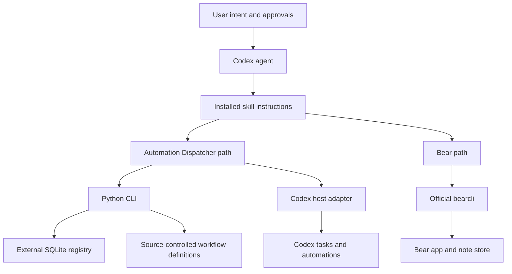

# 02 Architecture Overview

## Purpose

This document defines how repository authority, installed skills, deterministic tooling, host operations, external applications, and mutable state fit together. It identifies the boundaries that a rebuild or extension must preserve.

## Topology

The source repository supplies versioned skill packages and project authority. Installed skill copies route agents to the correct behavior. Automation Dispatcher adds a separately installed Python CLI and explicitly located runtime state. Bear delegates application operations to the CLI bundled with Bear.

## Module Map

| Area | Primary components | Responsibility |
| --- | --- | --- |
| Repository authority | `README.md`, `docs/prd/`, `docs/designs/`, `docs/plans/` | Describe the product, current contracts, approved design, and non-normative execution sequence |
| Skill discovery | `automation-dispatcher/SKILL.md`, `bear/SKILL.md`, skill metadata | Route matching requests and enforce high-level gates |
| Automation Dispatcher interface | `automation-dispatcher/README.md`, `references/`, `src/automation_dispatcher/cli.py` | Explain installation and provide deterministic JSON-capable commands |
| Automation Dispatcher definition and schedule model | `definitions.py`, `scheduling.py`, `registry.py` | Normalize collection IDs, workflow definitions, schedules, configuration, and effective revisions |
| Automation Dispatcher persistence | `database.py`, packaged migrations, `audit.py`, `backup.py` | Maintain external SQLite state, forward migrations, tamper-evident events, backups, verification, and sanitized exports |
| Automation Dispatcher execution | `claims.py`, `runner.py`, `receipts.py`, `routing.py` | Fence claims and leases, execute approved procedures, preserve external-effect ambiguity, deliver receipts, and verify route identity |
| Codex host integration | Agent-accessible task and automation tools | Inspect and change live tasks or automations, post receipts, and return observed identifiers |
| Bear operation | `bear/SKILL.md`, `bear/references/`, official `bearcli` | Resolve Bear commands, operate notes safely, and verify results |

## Runtime Boundaries

- Repository source, installed skill copies, installed CLI environments, mutable dispatcher state, source-controlled workflow definitions, Codex tasks, Codex automations, and Bear data are distinct surfaces.
- Automation Dispatcher databases, backups, exports, and lifecycle progress must never be stored inside the source checkout, an installed skill directory, or an installed CLI environment. A database normally lives in the verified working directory of the collection task under `.automation-dispatcher/`.
- The Automation Dispatcher CLI owns deterministic state validation and mutation. The skill must not edit the registry directly, and the CLI must not claim to perform Codex host mutations it cannot observe or reconcile.
- The Codex host adapter owns live task and automation calls. Source changes, CLI installation, database initialization, and live cutover are separate authorization scopes.
- Bear's CLI operates local Bear state. App-opening commands are visible UI actions and remain distinct from background reads and writes.
- Each skill loads only the references required for the current operation and does not treat unrelated task conversation or memory as product authority.

## Data Flow

### Automation Dispatcher operation

1. The agent resolves the collection, database path, route, requested mode, and observed identity.
2. The CLI verifies migrations, database integrity, audit continuity, route assurance, workflow definition hashes, and schedule coverage.
3. The CLI evaluates collection occurrences and fans each selected occurrence out to enabled workflows valid within the applicable effective-dated intervals.
4. A worker claims one workflow occurrence with revision, route, lease, and occurrence metadata pinned in SQLite.
5. The runner executes an approved script or returns a host action. External-effect starts are persisted before execution can become ambiguous.
6. The terminal run transition and its material receipt are persisted atomically.
7. The agent fences the receipt posting attempt, posts the exact persisted payload through the host, reconciles it, and acknowledges the external message identifier.

### Automation Dispatcher guided lifecycle

1. The agent discovers in-scope Codex tasks and automations without mutation and normalizes a hashed snapshot.
2. The agent and CLI produce a reviewable lifecycle plan that binds to that snapshot.
3. After approval, the CLI applies non-live initialization and records resumable progress.
4. Shadow validation proves runtime, schedule, route, receipt, backup, and cutover boundaries without live workflow effects.
5. After a separate collection-specific approval, the host applies task or automation changes and returns observed state for durable recording and reconciliation.

### Bear operation

1. The agent resolves the official CLI and inspects live help for unfamiliar or version-sensitive commands.
2. It resolves the exact note, section, tag, pin, attachment, or selection target with the narrowest read.
3. It performs the narrowest authorized mutation and interprets the command's exit status.
4. It verifies silent or consequential mutations through an appropriate follow-up read.

## Configuration Surfaces

- Automation Dispatcher collection configuration: dispatcher ID, name, description, cron schedule or supported preset, timezone, lateness, catch-up policy, heartbeat coverage, route expectations, identity requirements, and installed versions.
- Automation Dispatcher workflow definition: collection membership, revision, procedure, external-effect policy, retry and lease policy, authority references, reporting, sensitivity, and evidence retention. Workflow definitions do not contain schedules.
- Automation Dispatcher lifecycle artifacts: versioned discovery snapshots, lifecycle plans, portable manifests, stable operation IDs, hashes, per-step state, and evidence references.
- Codex host state: task identifiers, working directories, automation identifiers, prompts, schedules, enabled state, and observable route or identity facts.
- Bear command surface: installed `bearcli` version, command-specific flags, note IDs, Bear search syntax, section addresses, tag names, pin contexts, attachment targets, and export support.
- Repository distribution: skill metadata, package metadata, lockfiles, migrations, references, validation scripts, and installation or upgrade instructions.

## Source Anchors

- [Repository README](../../README.md)
- `automation-dispatcher/src/automation_dispatcher/cli.py`
- `automation-dispatcher/src/automation_dispatcher/registry.py`
- `automation-dispatcher/src/automation_dispatcher/database.py`
- `automation-dispatcher/src/automation_dispatcher/claims.py`
- `automation-dispatcher/src/automation_dispatcher/receipts.py`
- [Automation Dispatcher registry contract](../../automation-dispatcher/references/registry-contract.md)
- [Automation Dispatcher guided-lifecycle design](../designs/2026-08-11-automation-dispatcher-guided-lifecycle-orchestration.md)
- [Bear skill](../../bear/SKILL.md)
